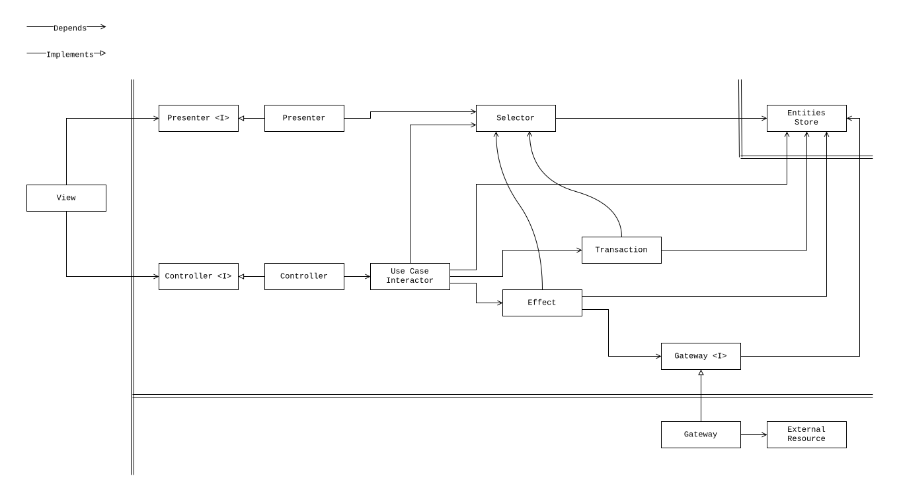

# Clean Architecture for Frontend Exercise

This repository demonstrates how to implement clean architecture principles in
frontend applications using a simple counter example. The project showcases the
evolution from a basic single-file implementation to a modular, multi-unit
structure.

## Repository Structure

### `counter-task`

This directory provides the basic implementation and serves as the starting
point for the exercise. It represents a typical frontend application using clean
architecture, but with most units inlined. The Git history illustrates the
workflow of feature implementation.

### `counter-result`

This directory demonstrates the final result after refactoring into a modular,
multi-unit implementation.

## Exercise Overview

The exercise focuses on understanding clean architecture units and the evolution
of a codebase within this context. You will learn how features are added and
developed in applications that follow clean architecture principles.

## Developer Tasks

Your tasks for refactoring the counter application are as follows:

### 1. Make Increment Count Optimistic

Transform the increment operation to be optimistic. The counter value should
increment immediately in the UI, while the actual increment operation is
performed in the background.

### 2. Refactor Codebase for Maximum Modularity

Break down the existing code in the `counter-task` directory into as many units
as possible, following the diagram representing clean architecture for frontend
applications.

### 3.* Add a CLI tool for the browser developers console

This task is optional but recommended for those who want to enhance their
development experience. Create a CLI tool that can be used in the browser
developers console to interact with the counter application. This tool should
allow developers to perform actions such as incrementing the counter, resetting
it, and viewing the current count.

## Getting Started

1. Examine the `counter-task` directory to understand the initial
   implementation.
2. Review the Git commit history to see the evolution of changes in
   `counter-task`. The commit history represents the basic development flow of a
   feature in an application that follows clean architecture.
3. Implement the required optimistic update functionality.
4. Refactor the codebase to extract as many units as possible.
5. Compare your result with the `counter-result` directory.

## Note

The `counter-result` example demonstrates that only one use case interactor has
been broken down into reusable units.
